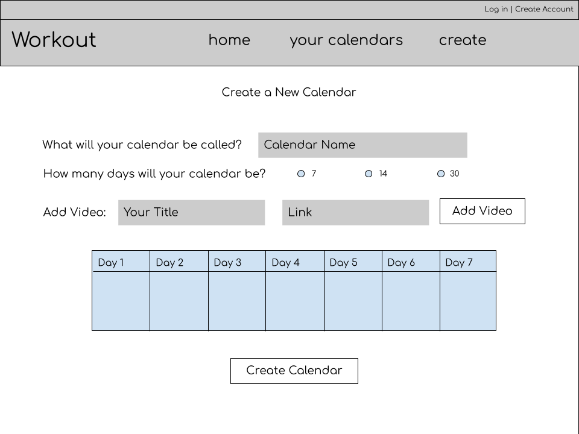

# Workout 

## Overview

Over the pandemic, many found themselves turning to at-home workouts via Youtube for a safe alternative to the gym, but it can be difficult to keep track of which videos you've done/you plan on doing when creating a routine. 

Workout is a web app that will allow users to either follow pre-existing workout calendars from fitness Youtubers. Users will be able to check off the days/workouts they've done to keep track of their progress & create their own workout calendars. They will even be able to share said calendars with other users so multiple users may follow a calendar at once and see each other's progress. 


## Data Model

The application will store Users, Calendars and Videos

* users can have multiple Calendars (via references)
* each list can have multiple Videos (by embedding)

An Example User:

```javascript
{
  username: "someUser",
  hash: // a password hash,
  calendars: // an array of references to Calendars
}
```

An Example Calendar with Embedded Videos:

```javascript
{
  creator: // a reference to the User object that created the calendar
  users: // array of references to Users added to the calendar
  name: "7-day Workout Calendar",
  videos: [ // array of array of video objects 
    [{ name: "Arm & Back Workout", link: "www.youtube.com/...", finished: true},
    { name: "Leg Workout", link: "www.youtube.com/...", finished: false}],
    [],
    [{ name: "Arm & Back Workout", link: "www.youtube.com/...", finished: true}]
  ]
}
```


## [Link to Commented First Draft Schema](db.js) 

## Wireframes

/home - page with pre-loaded calendars to pick from 


/calendars/add - page for creating a new calendar



/calendars - page for showing all of the user's calendars


/calendars/slug - page for showing specific calendar 


## Site map


## User Stories

1. as non-registered user, I can register a new account with the site
2. as a user, I can log in to the site
3. as a user, I can create a new calendar
4. as a user, I can view all of the calendars I've created on a single webpage
5. as a user, I can add items to an existing calendar
6. as a user, I can cross off items in an existing calendar

## Research Topics

* Use Grunt to integrate JSHint
    * I'm going to use Grunt + JSHint to run automatically on file change

* Passport
    * I will use passport for user authentication


## [Link to Initial Main Project File](app.js) 

## Annotations / References Used

1. [Grunt setup with JSHint](https://www.codereadability.com/jshint-with-grunt/)
2. [Passport setup](http://www.passportjs.org/docs/)

